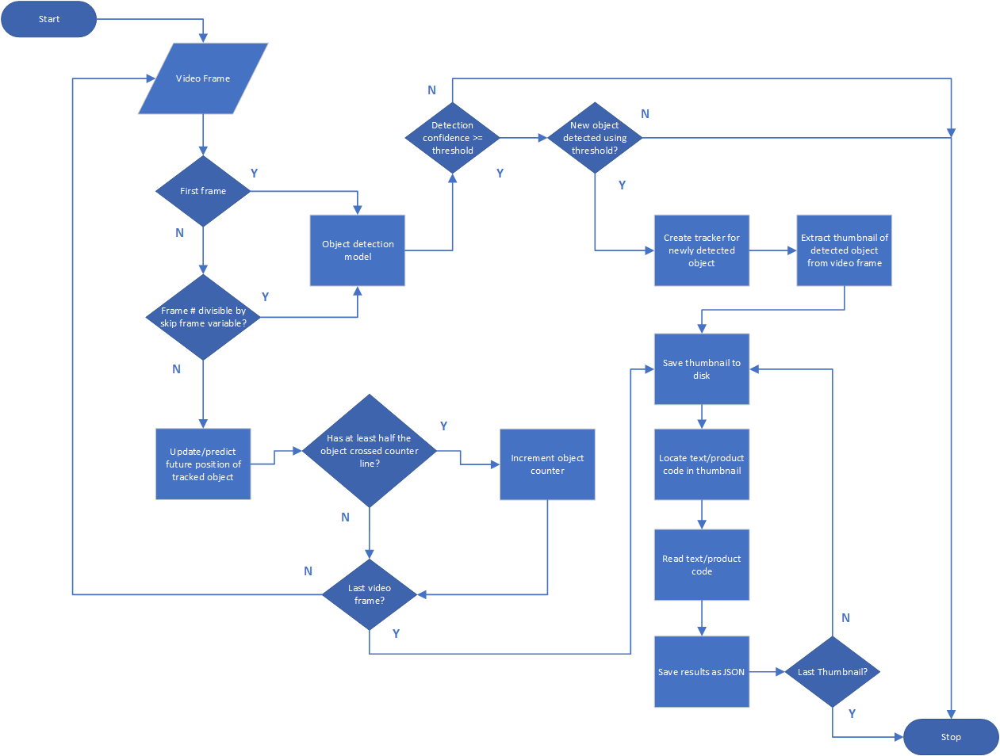

Overview of the solution
************************
The main objective of the solution is to automate the process of pallet loading and unloading at Warehouses. To achieve this the following activities need to be performed on a video file or a video stream:

1. Object Detection
2. Object Tracking
3. Object Counting
4. Optical Character Recognition (OCR) or product code scanning (e.g. barcode, QR code)

Process diagram
==============================

Screen shots
============

+------------------------------------------+------------------------------------------+
| .. figure:: images/screen_shot_01.png    | .. figure:: images/screen_shot_02.png    |
|    :width: 30%                           |    :width: 30%                           |
|                                          |                                          |
|    Top to bottom orientation             |    Right to Left orientation             |
+------------------------------------------+------------------------------------------+